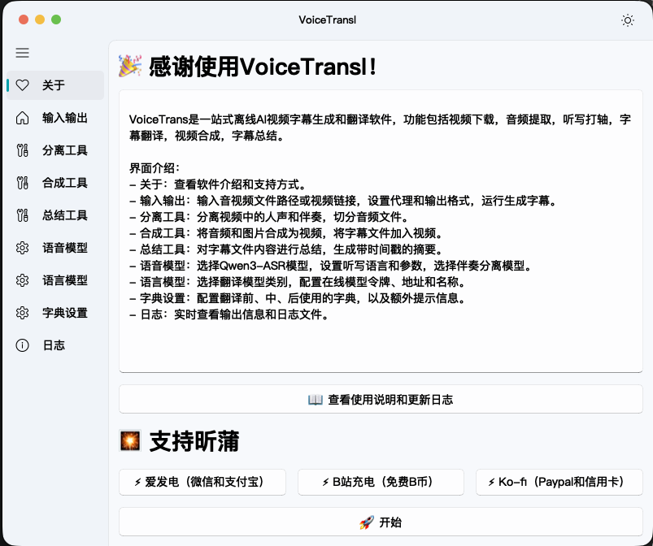

	

<h1>
VoiceTransl 聆译
</h1>

      

VoiceTransl 聆译是一站式离线 AI 视频字幕生成和翻译软件，支持 **macOS（Apple Silicon）**。从视频下载，音频提取，听写打轴，字幕翻译，视频合成，字幕总结各个环节为翻译者提供便利。本项目基于 [GalTransl](https://github.com/xd2333/GalTransl)，采用 GPLv3 许可，是 [shinnpuru/VoiceTransl](https://github.com/shinnpuru/VoiceTransl) 的 macOS 移植版本。

> **本项目的 macOS 移植工作（包括代码适配、构建打包、文档撰写与 Release 发布）完全由 AI 完成**，未经人工逐行审查。如发现移植缺陷或兼容性问题，欢迎提 Issue 反馈。

## 特色

* 支持多种翻译模型，包括在线模型（任意 OpenAI 兼容接口）和本地模型（Sakura、GalTransl 及 Ollama、Llama.cpp）。
* 支持多种输入格式，包括音频、视频、SRT 字幕。
* 支持多种输出格式，包括 SRT 字幕、LRC 字幕。
* 支持多种语言，包括日语，英语，韩语，俄语，法语。
* 使用 CrispASR 的 Qwen3-ASR 与强制对齐工作流生成带时间轴字幕。
* 支持 VAD（语音活动检测），自动识别音频中的语音段落。
* 支持字典功能，可以自定义翻译字典，替换输入输出。
* 支持世界书/台本输入，可以自定义翻译参考资料。
* 支持从 YouTube/Bilibili 及媒体链接直接下载视频。
* 支持文件和链接批量处理，自动识别文件类型。
* 支持音频切分，字幕合并和视频合成。
* 支持视频总结，将视频内容总结为带时间轴简短的文本。
* 支持人声分离，将人声和伴奏分离，支持多种模型。

## 下载地址

下载最新版本的 [VoiceTransl for macOS](https://github.com/Eiranya/VoiceTransl_Apple-silicon/releases/)，将 `VoiceTransl.app` 拖入「应用程序」即可使用。

## 使用说明

使用说明请见 [视频教程](https://www.bilibili.com/video/BV12FjN6iEmz)。

## 模型文件

本仓库不包含模型权重文件。安装镜像（dmg）中**已捆绑 Canary CTC 强制对齐器**，开箱即用；**ASR 语音识别模型需自行下载**，放入应用内的 `crispasr` 目录。

**推荐的放置方式（最省事）：** 打开应用 →「设置」页 → 点击 **「📁 打开CrispASR目录」**，访达会直接打开正确目录，把下载好的 `.gguf` 拖进去，再点 **「🔄 刷新语音模型列表」**（或重启应用），即可在「🗣️ 识别模型」下拉框中选择。

> 手动前往也可以：右键 `VoiceTransl.app` →「显示包内容」。以下两个位置**都会被识别**，任选其一即可：
> `Contents/Frameworks/crispasr/` 或 `Contents/Resources/crispasr/`。

| 文件 | 文件名 | 大致体积 | 下载来源 |
| --- | --- | --- | --- |
| Qwen3-ASR-1.7B 语音识别模型（GGUF, q4_k） | `qwen3-asr-1.7b-q4_k.gguf` | ~1.4 GB | [夸克网盘](https://pan.quark.cn/s/0dafa8663ee5#/list/share) |
| Qwen3-ASR-1.7B 日语动画微调（GGUF, q4_k，可选） | `qwen3-asr-1.7b-ja-anime-q4_k.gguf` | ~1.4 GB | [夸克网盘](https://pan.quark.cn/s/0dafa8663ee5#/list/share) |
| Canary CTC 强制对齐器（GGUF, q4_k） | `canary-ctc-aligner-q4_k.gguf` | ~392 MB | **已随 dmg 捆绑**，无需下载 |

> 说明：CrispASR 上游仅提供 **arm64** 版本，因此本 macOS 构建仅支持 Apple Silicon（M 系列）芯片；Intel Mac 无法使用该 ASR 引擎。

**缺失文件时的现象：**
- 未放置主 ASR 模型（`qwen3-asr-1.7b-q4_k.gguf`）：「🗣️ 识别模型」下拉框为空，开始听写/翻译时会提示找不到模型，无法生成字幕；程序其余界面仍可正常打开。
- 未放置 `ffmpeg/ffmpeg`：提取音频、视频合成等依赖 ffmpeg 的步骤会失败，程序会提示「未找到 ffmpeg」。
- Canary 对齐器已随 dmg 捆绑，无需单独下载；如误删 `canary-ctc-aligner-q4_k.gguf`，CrispASR 断句对齐将无法工作（SRT 时间戳会被清零）。
- 未放置 UVR 人声分离权重（可选）：仅「🎤 人声分离模型」下拉框为空、人声分离不可用，其余功能不受影响。
- 未放置翻译模型（可选）：仅离线翻译不可用，可改用在线翻译接口。

**人声分离（UVR）模型：** 与识别模型同理 —— 在「设置」页点击 **「📁 打开UVR模型目录」**，把自行下载的 UVR 系列 `.onnx` 权重（如 `UVR-MDX-NET-Inst_HQ_3.onnx`）放入，再点 **「🔄 刷新人声分离模型列表」** 或重启应用。对应的包内路径为 `Contents/Frameworks/separate/` 或 `Contents/Resources/separate/`（两者都会被识别）。dmg 中已捆绑 `onnxruntime`（含 CoreML 加速），无需额外安装依赖。

**翻译模型（llama.cpp）：** 本仓库与 dmg 均**不包含**翻译模型，需自行下载 `.gguf` 权重放入离线模型目录（高级设置页点击 **「📁 打开离线模型目录」**，对应 `Contents/Frameworks/llama/` 或 `Contents/Resources/llama/`），再点 **「🔄 刷新离线模型列表」**；未放置时请使用在线翻译接口。

## 对比原版 VoiceTransl 的修改

本仓库是 [shinnpuru/VoiceTransl](https://github.com/shinnpuru/VoiceTransl)（原 Windows 版）的 macOS 移植分支，主要修改如下：

| 项 | 原版 VoiceTransl（Windows） | 本 macOS 分支 |
| --- | --- | --- |
| 支持平台 | Windows（x64） | macOS（Apple Silicon / arm64） |
| 安装形式 | Windows 安装程序（NSIS），运行 `VoiceTransl.exe` | `.dmg` 磁盘镜像，拖入「应用程序」 |
| ASR 引擎 | 早期 whisper.cpp / faster-whisper；新版本亦采用 CrispASR | CrispASR（Qwen3-ASR + CTC 强制对齐） |
| 运行时引擎 | 需自行配置 | CrispASR / llama.cpp / FFmpeg 随 dmg 捆绑 |
| 模型文件 | 随安装包分发 | ASR 模型**不包含**（自行下载放入 `crispasr/`）；Canary 对齐器已随 dmg 捆绑 |
| 界面框架 | PyQt5 + PyQt-Fluent-Widgets | 同，但适配 macOS HIG：系统原生红绿灯标题栏、Finder 风格导航面板 |
| 模型目录 | 多为 `qwen3-asr-1.7b/` 等 | 本分支将 ASR 模型与对齐器统一放在 `crispasr/` 目录 |
| 系统关机 / 路径 | Windows 专用逻辑 | 改用 `osascript` 等 macOS 原生调用 |
| 代码签名 | 作者签名 / 公证 | ad-hoc 签名，未公证（暂无 Developer ID 证书） |

> 说明：本分支基于 upstream v1.30（已含 CrispASR），其余翻译 / 对齐能力与原版一致。

## 声明

本软件仅供学习交流使用，不得用于商业用途。本软件不对任何使用者的行为负责，不保证翻译结果的准确性。使用本软件即代表您同意自行承担使用本软件的风险，包括但不限于版权风险、法律风险等。请遵守当地法律法规，不要使用本软件进行任何违法行为。

## 贡献者

@[shinnpuru](https://github.com/shinnpuru) @[MurthiNext](https://github.com/MurthiNext)

## 如果对你有帮助的话请给一个Star!

